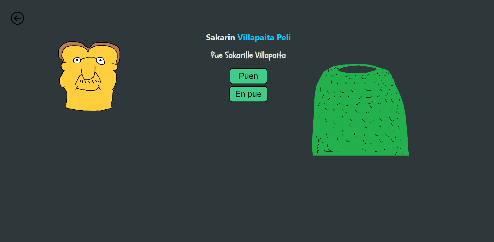

# Joonan Pelit

Tein nettisivun missä on 3 erilaista pientä peliä.

Käytin sivujen väliseen navigointiin React Router DOM:ia. Syy tähän oli se, että käyttäjä saa sulavamman käyttökokemuksen sivulla,
siten että kun käyttäjä vaihtaa sivua niin se ei lataudu uudelleen, kuten perinteisten HTML-linkkien avulla vaan sivujen navigointia
hallitaan dynaamisesti. React Router DOM mahdollistaa tehokkaamman ja joustavamman sivujenvälisen navigoinnin.

React Router DOM on mahdollista lisätä React projektiin seuraavalla tavalla:
```
npm install react-router-dom
```


Etusivu:


Peli 1. Ristinolla:

> Ristinollan ohjelma tarkistaa mahdolliset voittoyhdistelmät sekä tasapelin.


Peli 2. Sakarin Villapaita Peli:

> Piirtelin itse hurjilla taiteellisilla taidoillani sakarin ja villapaidan.



peli 3. Reaktiotesti Peli

> Reaktiotestissä klikkaamalla ruutua ajastin arpoo satunnaisen ajan jonka jälkeen ruutu muuttuu vihreäksi.
> Klikkaamalla ruutua mahdollisimman nopeasti sen muututtua, ohjelma laskee millisekunteina kauanko aikaa kului.

